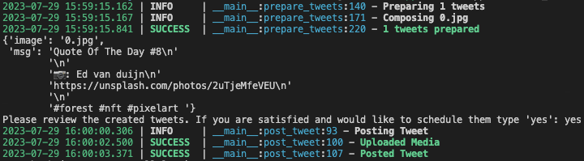
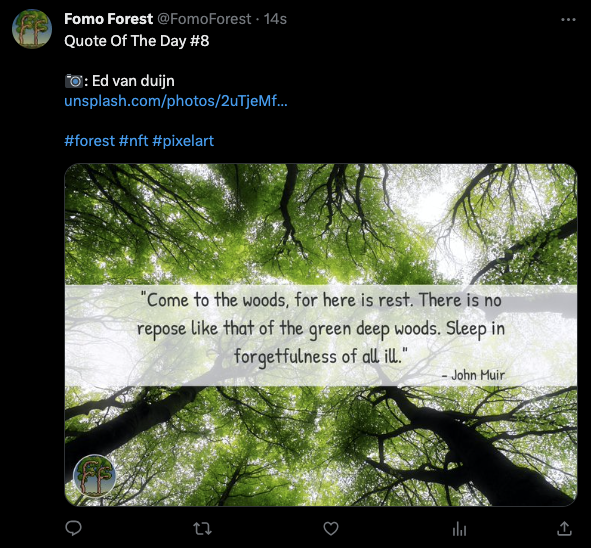

# Automatic Tweet Generator

This project was created for a marketing campaign for an in development NFT. The goal was to create a program that would
automatically generate tweets including a programatically generated image, image description, and hashtags.

The programatically generated image is created using the [Pillow](https://pillow.readthedocs.io/en/stable/) library. An image is taken from a separately generated set of Unsplash images and a random quote was taken from a set of quotes scraped from the web. The quote and a watermark are formatted onto the image and the image is saved to a temporary directory.

Images are generated in bulk and paired with the tweet text and hashtags. After approval The tweets are scheduled using the schedule library and posted using the [Tweepy](https://www.tweepy.org/) library.

## Requirements

### Python >= 3.8

Most systems will have Python installed, to verify your version run `python3 --version` in your command line. If your version is lower than 3.8 or the command does not return a version number, visit the Python [downloads page](https://www.python.org/downloads/) and download the latest version.

Alternatively you can use a python environment manager such as [pyenv](https://github.com/pyenv/pyenv) to install and manage your python versions. This is the recommended method as it allows you to easily switch between python versions.

### Poetry

Poetry is a python package manager and virtual environment manager. It is used to install the required dependencies and manage the project's virtual environment. To install poetry visit the [Poetry installation page](https://python-poetry.org/docs/#installation) and follow the instructions for your operating system.

## Installation

Clone the repository using your preferred cloning method or download the ZIP.

Navigate to the project directory and run `poetry install` in your command line. This will install all the required dependencies and create a virtual environment for the project. To activate the virtual environment run `poetry shell` in your command line.

## Setup

### Picture Download

This project uses Unsplash to download the pictures. Picture information is stored to provide appropriate credit. To download pictures you will need an Unsplash account and an API key. You can create an account [here](https://unsplash.com/join) and create an API key [here](https://unsplash.com/oauth/applications). Once you have your API key you can download the images using the `custom_download.py` script in the `pictures` directory. To use the script you will need to set the `ACCESS_KEY` variable in `config.ini`. Run the script using `python3 app/data/pictures/custom_download.py` in your command line. Without any arguement the script will download 1 random image from Unsplash. You can see the available arguements by running `python3 app/data/pictures/custom_download.py --help`.

### Quote Capture

This project uses web scraping to generate quotes, but quotes can be added manually. To add quotes manually, create a csv file in the `app/data/quotes` directory. The csv file should have 2 columns, the first column should contain the quote and the second column should contain the author. To scrape quotes from the web reference the script in the quotes directory and adjust accordingly.

### Twitter

This project uses Twitter to post the tweets. To use Twitter you will need a Twitter account and a Twitter developer account. You can create a Twitter account [here](https://twitter.com/i/flow/signup) and a Twitter developer account [here](https://developer.twitter.com/en/apply-for-access). Once you have your developer account you will need to create a new app. You can do this by clicking the `Create an app` button on the [developer dashboard](https://developer.twitter.com/en/portal/dashboard). Once you have created your app you will need to generate your API keys. You can do this by clicking the `Keys and tokens` tab on your app page. You will need to generate your access token and access token secret. Once you have your API keys you will need to set the `BEARER_TOKEN`, `CONSUMER_KEY`, `CONSUMER_SECRET`, `ACCESS_TOKEN`, and `ACCESS_TOKEN_SECRET` variables in `config.ini`.

## Usage

Run tweet scheduler using `python3 -m app.src.tweet_scheduler.schedule_tweets` in your command line. You can see the available arguements by running `python3 -m app.src.tweet_scheduler.schedule_tweets --help`. Once run, review the tweets and images in the `app/src/tweet_scheduler/media/` directory. If satisfied type `yes` and press enter to schedule the tweets. If not satisfied type `no` and press enter to exit the program.

## Project Status

The project is fully functional and meets all the set goals. However, as this was
related to another project that is on hold I am unlikely to continue work on the project. This project
was a fantastic learning experience and I hope to bring my newfound knowledge to future endeavours.